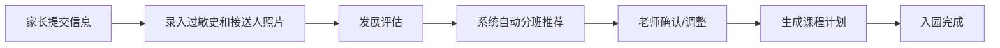
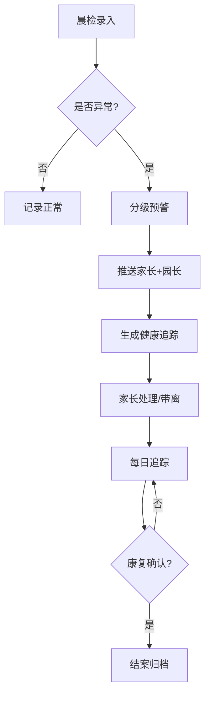
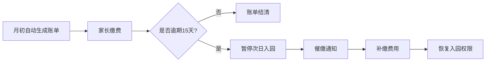

## 1. 产品概述
大型连锁幼儿园智慧管理平台，面向连锁幼儿园提供一体化数字化管理解决方案，涵盖幼儿入园、分班、课程、健康、接送、活动、费用等全流程管理，服务于园长、老师、家长、财务人员四类核心用户。

- 解决幼儿园多校区数据分散、人工管理效率低、安全接送风险高、健康追踪不及时等痛点
- 平台价值：提升管理效率、保障幼儿安全、增强家长满意度、辅助科学决策

## 2. 核心功能

### 2.1 用户角色
| 角色 | 注册方式 | 核心权限 |
|------|----------|----------|
| 超级管理员（总部） | 系统内置账号 | 全平台权限、多校区管理、系统设置、报表导出 |
| 园长 | 总部分配账号 | 本园数据查看、审批、预警处理、报表查看 |
| 老师 | 园长分配账号 | 本班幼儿管理、晨检录入、活动发布、请假审批 |
| 家长 | 手机号注册+绑定幼儿 | 查看幼儿信息、在线请假、活动报名、食谱反馈、接送码查看 |
| 财务 | 园长分配账号 | 费用结算、欠费管理、票据生成 |

### 2.2 功能模块
1. **登录页**：角色选择、账号登录、权限验证
2. **大屏首页**：实时出勤率、健康事件、活动热度、满意度、筛选、报表导出
3. **幼儿档案管理**：基本信息录入、过敏史管理、接送人照片录入、发展评估、自动分班
4. **班级与课程**：班级管理、课程计划推荐、课程调整
5. **请假管理**：家长在线请假、餐费保教费自动调整、老师活动调整通知
6. **健康晨检**：晨检录入、异常预警家长和园长、健康追踪记录
7. **食谱管理**：按季节和过敏源自动生成食谱、家长反馈
8. **接送管理**：扫码接送、照片比对、异常警告
9. **活动管理**：活动发布、家长报名、人数统计、物资清单生成
10. **费用结算**：月度费用自动计算、欠费管理、超15天暂停入园、票据导出
11. **系统设置**：用户管理、权限分配、校区配置、字典维护

### 2.3 页面详情
| 页面名称 | 模块名称 | 功能描述 |
|-----------|-------------|---------------------|
| 登录页 | 表单区 | 账号密码登录、角色切换、记住密码、忘记密码 |
| 登录页 | 品牌区 | 平台Logo、宣传语、背景动效 |
| 大屏首页 | 顶部导航 | 标题、校区筛选、时间筛选、一键导出报表、用户菜单 |
| 大屏首页 | 核心指标卡 | 出勤率、在园人数、健康事件数、活动参与率、家长满意度 |
| 大屏首页 | 出勤率趋势图 | 近30天出勤率折线图，支持按校区/班级筛选 |
| 大屏首页 | 健康事件分布图 | 饼图展示各类健康事件占比（发热、咳嗽、过敏等） |
| 大屏首页 | 活动热度排行榜 | 柱状图展示各活动报名人数 |
| 大屏首页 | 实时预警列表 | 展示晨检异常、接送异常、欠费预警 |
| 大屏首页 | 满意度分布 | 星级满意度条形图 |
| 幼儿档案 | 列表区 | 幼儿信息列表、搜索、筛选、分页 |
| 幼儿档案 | 录入表单 | 基本信息、过敏史（多选+自定义）、接送人信息与照片上传、发展评估量表 |
| 幼儿档案 | 分班结果 | 自动推荐班级、手动调整、生成课程计划推荐 |
| 班级课程 | 班级列表 | 班级卡片展示：班级名称、人数、班主任、教室 |
| 班级课程 | 课程计划 | 周课表展示、课程推荐、手动调整、拖拽排课 |
| 请假管理 | 家长端请假 | 请假类型、日期范围、原因、附件上传 |
| 请假管理 | 老师端审批 | 请假列表、审批、自动费用调整计算预览 |
| 请假管理 | 费用调整通知 | 餐费/保教费扣减明细、活动调整通知推送 |
| 健康晨检 | 晨检录入 | 体温、口腔、手部、皮肤、精神状态快捷录入 |
| 健康晨检 | 异常预警 | 自动通知家长+园长、分级预警（普通/严重） |
| 健康晨检 | 健康追踪 | 追踪记录时间线、康复确认、统计报表 |
| 食谱管理 | 食谱日历 | 按周展示食谱、春/夏/秋/冬四季切换 |
| 食谱管理 | 智能生成 | 一键按季节和过敏源生成食谱、营养分析 |
| 食谱管理 | 家长反馈 | 点赞、评论、评分、过敏提醒 |
| 接送管理 | 接送码 | 动态二维码、接送人照片展示 |
| 接送管理 | 扫码核验 | 扫码比对接送人照片、语音提示、异常告警 |
| 接送管理 | 接送记录 | 接送日志、异常记录追溯 |
| 活动管理 | 活动发布 | 活动信息、时间、地点、名额、物资需求 |
| 活动管理 | 家长报名 | 活动列表、在线报名、取消报名 |
| 活动管理 | 物资清单 | 根据报名人数自动计算物资、导出清单 |
| 费用结算 | 月度账单 | 费用明细（保教费、餐费、活动费等）、自动计算 |
| 费用结算 | 欠费管理 | 欠费列表、超15天自动标记暂停入园、催缴通知 |
| 费用结算 | 票据导出 | PDF/Excel导出、批量打印 |
| 系统设置 | 用户管理 | 用户增删改、角色分配、账号启用/禁用 |
| 系统设置 | 权限管理 | 四级权限矩阵、功能权限配置 |
| 系统设置 | 校区管理 | 多校区配置、班级、教室、老师分配 |
| 系统设置 | 字典维护 | 过敏源、课程类型、请假类型等基础数据 |

## 3. 核心流程

### 3.1 幼儿入园流程
家长提交幼儿信息 → 录入过敏史和接送人照片 → 完成发展评估 → 系统自动推荐班级和课程 → 园长/老师确认 → 分班完成

### 3.2 晨检异常流程
老师晨检录入 → 系统判断异常 → 自动推送预警给家长和园长 → 生成健康追踪记录 → 家长反馈/带离 → 持续追踪至康复

### 3.3 费用结算流程
月初自动生成月度账单 → 家长缴费 → 欠费超15天触发暂停入园 → 催缴通知 → 缴费成功恢复入园

## 4. 用户界面设计

### 4.1 设计风格
- **主色调**：温暖橙黄色系（#FF8C42 主色、#FFB07C 辅助色），搭配天蓝色（#4ECDC4）点缀，体现幼儿园温馨活泼的氛围
- **辅助色**：柔和绿色（#95D5B2）表示健康正常，珊瑚红（#FF6B6B）表示预警异常
- **中性色**：暖白背景（#FFFBF5）、深灰文字（#2D3436）
- **按钮风格**：大圆角（12px）、柔和渐变、悬浮微放大动效
- **字体**：标题使用"站酷快乐体"/圆润无衬线字体，正文使用思源黑体
- **布局风格**：卡片式布局、大量圆角、柔和阴影、丰富留白
- **图标风格**：线条圆润的填充图标、emoji点缀、童趣插画元素
- **整体风格**：温馨活泼、干净通透、亲和可信

### 4.2 页面设计概览
| 页面名称 | 模块名称 | UI元素 |
|-----------|-------------|-------------|
| 登录页 | 品牌区 | 渐变背景、童趣插画、大标题品牌展示、浮动装饰元素 |
| 登录页 | 表单区 | 白色圆角卡片、柔和阴影、大号输入框、角色切换Tab |
| 大屏首页 | 指标卡 | 彩色渐变背景、大号数字、趋势箭头、图标装饰 |
| 大屏首页 | 图表区 | ECharts图表、圆角容器、渐变色图例、悬浮交互 |
| 大屏首页 | 预警列表 | 红/橙/黄三色预警条、时间戳、快捷处理按钮 |
| 幼儿档案 | 表单 | 分组卡片、上传区域、标签选择器、星级评估、步骤条 |
| 班级课程 | 课表 | 网格布局、颜色区隔课程、拖拽排课、弹窗编辑 |
| 接送管理 | 二维码 | 大尺寸动态二维码、接送人照片、刷新倒计时、语音播报按钮 |
| 费用结算 | 账单 | 明细折叠卡片、费用合计高亮、逾期红色警告、支付按钮 |
| 系统设置 | 权限矩阵 | 表格布局、开关切换、角色列头、批量保存 |

### 4.3 响应式
- 桌面端优先设计（大屏首页适配1920×1080及以上）
- 家长端功能适配平板和手机端（响应式布局）
- 触控优化：大按钮、足够点击区域、滑动手势支持
