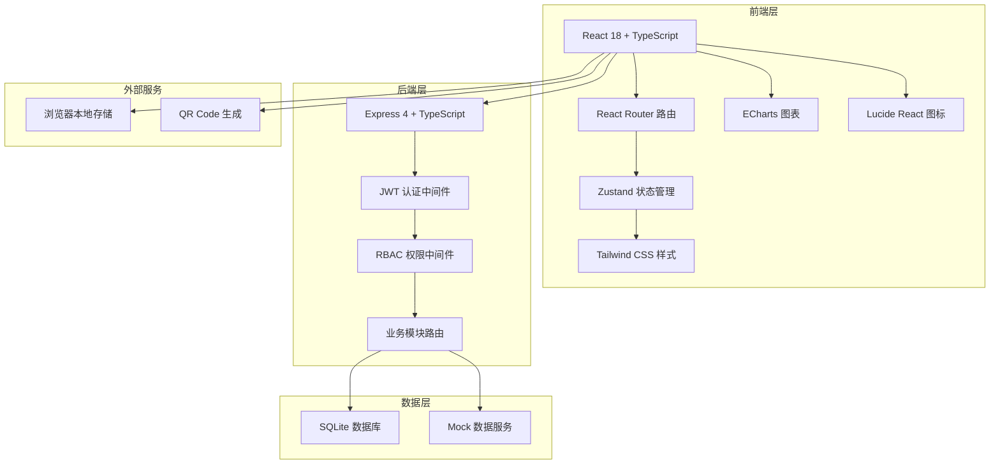
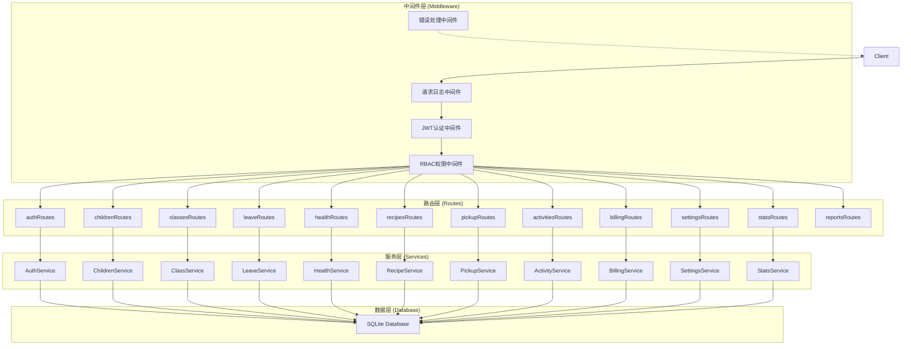

## 1. 架构设计



## 2. 技术说明
- **前端**：React@18 + TypeScript + Vite + TailwindCSS@3 + Zustand + React Router Dom + ECharts + qrcode.react
- **后端**：Express@4 + TypeScript + JWT + better-sqlite3
- **数据库**：SQLite（开发演示用，内置Mock数据）
- **初始化工具**：vite-init（react-express-ts模板）
- **状态管理**：Zustand 管理全局状态（用户信息、权限、实时数据）

## 3. 路由定义

### 前端路由
| 路由 | 页面 | 权限角色 |
|-------|------|----------|
| /login | 登录页 | 公开 |
| /dashboard | 大屏首页 | 超级管理员、园长、老师、财务 |
| /children | 幼儿档案管理 | 超级管理员、园长、老师 |
| /classes | 班级与课程 | 超级管理员、园长、老师 |
| /leave | 请假管理 | 全部角色（家长可发起，老师可审批） |
| /health | 健康晨检 | 超级管理员、园长、老师 |
| /recipes | 食谱管理 | 超级管理员、园长、老师、家长（仅查看和反馈） |
| /pickup | 接送管理 | 超级管理员、园长、老师、家长（仅查看接送码） |
| /activities | 活动管理 | 超级管理员、园长、老师（发布）、家长（报名） |
| /billing | 费用结算 | 超级管理员、园长、财务、家长（仅查看自己账单） |
| /settings | 系统设置 | 超级管理员、园长 |

### 后端 API 路由
| 路由前缀 | 用途 |
|----------|------|
| /api/auth | 登录、注册、登出、获取当前用户 |
| /api/children | 幼儿档案CRUD、分班推荐、发展评估 |
| /api/classes | 班级CRUD、课程计划CRUD |
| /api/leave | 请假申请、审批、费用调整计算 |
| /api/health | 晨检录入、预警、健康追踪 |
| /api/recipes | 食谱CRUD、智能生成、家长反馈 |
| /api/pickup | 接送码生成、扫码核验、接送记录 |
| /api/activities | 活动CRUD、报名、物资清单 |
| /api/billing | 月度账单、欠费管理、缴费记录 |
| /api/settings | 用户管理、权限配置、校区管理、字典 |
| /api/reports | 报表导出（Excel/PDF） |
| /api/stats | 大屏统计数据 |

## 4. API 类型定义

```typescript
// 通用响应
interface ApiResponse<T> {
  code: number;
  message: string;
  data: T;
}

// 用户
enum UserRole {
  SUPER_ADMIN = 'super_admin',
  PRINCIPAL = 'principal',
  TEACHER = 'teacher',
  PARENT = 'parent',
  FINANCE = 'finance'
}
interface User {
  id: number;
  username: string;
  name: string;
  role: UserRole;
  campusId?: number;
  phone: string;
  avatar?: string;
  status: 'active' | 'disabled';
  createdAt: string;
}

// 幼儿
interface Child {
  id: number;
  name: string;
  gender: 'male' | 'female';
  birthDate: string;
  age: number;
  campusId: number;
  classId?: number;
  avatar?: string;
  allergies: string[];
  medicalHistory?: string;
  guardians: Guardian[];
  developmentScore?: DevelopmentScore;
  status: 'active' | 'suspended' | 'graduated';
  createdAt: string;
}
interface Guardian {
  id: number;
  name: string;
  relation: string;
  phone: string;
  photo: string;
  idCard?: string;
}
interface DevelopmentScore {
  language: number;
  motor: number;
  social: number;
  cognitive: number;
  overall: number;
}

// 班级
interface Class {
  id: number;
  name: string;
  campusId: number;
  teacherId: number;
  teacherName?: string;
  classroom: string;
  capacity: number;
  studentCount: number;
  ageRange: [number, number];
  courses: CoursePlan[];
}
interface CoursePlan {
  id: number;
  classId: number;
  weekDay: number;
  period: string;
  name: string;
  category: string;
  description?: string;
}

// 请假
enum LeaveStatus {
  PENDING = 'pending',
  APPROVED = 'approved',
  REJECTED = 'rejected'
}
interface LeaveRecord {
  id: number;
  childId: number;
  childName?: string;
  parentId: number;
  parentName?: string;
  type: 'sick' | 'personal' | 'other';
  startDate: string;
  endDate: string;
  reason: string;
  attachment?: string;
  status: LeaveStatus;
  feeAdjustment: FeeAdjustment;
  approvedBy?: number;
  approvedAt?: string;
  createdAt: string;
}
interface FeeAdjustment {
  mealFeeDeduction: number;
  tuitionDeduction: number;
  totalDeduction: number;
  days: number;
}

// 健康
enum HealthAlertLevel {
  NORMAL = 'normal',
  WARNING = 'warning',
  DANGER = 'danger'
}
interface MorningCheck {
  id: number;
  childId: number;
  childName?: string;
  teacherId: number;
  teacherName?: string;
  classId?: number;
  temperature: number;
  oralCheck: 'normal' | 'abnormal';
  handCheck: 'normal' | 'abnormal';
  skinCheck: 'normal' | 'abnormal';
  spiritCheck: 'normal' | 'abnormal';
  note?: string;
  alertLevel: HealthAlertLevel;
  createdAt: string;
}
interface HealthTracking {
  id: number;
  childId: number;
  checkId: number;
  records: TrackingRecord[];
  status: 'tracking' | 'recovered';
  createdAt: string;
}
interface TrackingRecord {
  id: number;
  date: string;
  status: string;
  note?: string;
  operator: string;
}

// 食谱
interface Recipe {
  id: number;
  date: string;
  campusId: number;
  season: 'spring' | 'summer' | 'autumn' | 'winter';
  meals: Meal[];
  feedback: RecipeFeedback[];
}
interface Meal {
  type: 'breakfast' | 'lunch' | 'dinner' | 'snack_am' | 'snack_pm';
  dishes: Dish[];
}
interface Dish {
  name: string;
  ingredients: string[];
  nutrition: string;
  allergens: string[];
}
interface RecipeFeedback {
  id: number;
  recipeId: number;
  parentId: number;
  rating: number;
  comment?: string;
  createdAt: string;
}

// 接送
interface PickupCode {
  id: number;
  childId: number;
  guardianId: number;
  code: string;
  qrCodeData: string;
  expiresAt: string;
  createdAt: string;
}
interface PickupRecord {
  id: number;
  childId: number;
  childName?: string;
  guardianId: number;
  guardianName?: string;
  guardianPhoto?: string;
  photoMatch: boolean;
  isAbnormal: boolean;
  abnormalNote?: string;
  operatorId?: number;
  createdAt: string;
}

// 活动
interface Activity {
  id: number;
  title: string;
  description: string;
  campusId: number;
  classIds?: number[];
  date: string;
  location: string;
  maxParticipants: number;
  registrations: ActivityRegistration[];
  materials: ActivityMaterial[];
  createdBy: number;
  createdAt: string;
}
interface ActivityRegistration {
  id: number;
  activityId: number;
  childId: number;
  parentId: number;
  note?: string;
  createdAt: string;
}
interface ActivityMaterial {
  name: string;
  quantityPerPerson: number;
  unit: string;
  totalQuantity: number;
  note?: string;
}

// 费用
interface Bill {
  id: number;
  childId: number;
  childName?: string;
  month: string;
  campusId: number;
  items: BillItem[];
  totalAmount: number;
  paidAmount: number;
  status: 'unpaid' | 'partial' | 'paid' | 'suspended';
  dueDate: string;
  suspendedAt?: string;
  paidAt?: string;
  createdAt: string;
}
interface BillItem {
  type: 'tuition' | 'meal' | 'activity' | 'other';
  name: string;
  amount: number;
  deduction?: number;
  note?: string;
}

// 统计
interface DashboardStats {
  attendance: {
    todayRate: number;
    trend: number[];
    byClass: { name: string; rate: number }[];
  };
  health: {
    todayEvents: number;
    activeAlerts: number;
    eventDistribution: { name: string; value: number }[];
    trackingCount: number;
  };
  activities: {
    ongoingCount: number;
    popularity: { name: string; count: number }[];
  };
  satisfaction: {
    average: number;
    distribution: number[];
  };
  warnings: WarningItem[];
}
interface WarningItem {
  id: number;
  type: 'health' | 'pickup' | 'billing';
  level: 'warning' | 'danger';
  message: string;
  createdAt: string;
}
```

## 5. 服务端架构图



## 6. 数据模型

### 6.1 ER图

```mermaid
erDiagram
    USER ||--o{ CHILD : "家长绑定"
    USER ||--o{ CLASS : "老师担任"
    USER ||--o{ MORNING_CHECK : "录入"
    USER ||--o{ LEAVE_RECORD : "审批"
    CAMPUS ||--o{ CLASS : "包含"
    CAMPUS ||--o{ CHILD : "包含"
    CAMPUS ||--o{ RECIPE : "发布"
    CAMPUS ||--o{ ACTIVITY : "发布"
    CLASS ||--o{ CHILD : "收纳"
    CLASS ||--o{ COURSE_PLAN : "排课"
    CHILD ||--o{ GUARDIAN : "有"
    CHILD ||--o{ LEAVE_RECORD : "请假"
    CHILD ||--o{ MORNING_CHECK : "晨检"
    CHILD ||--o{ HEALTH_TRACKING : "追踪"
    CHILD ||--o{ PICKUP_CODE : "生成"
    CHILD ||--o{ PICKUP_RECORD : "接送"
    CHILD ||--o{ ACTIVITY_REGISTRATION : "报名"
    CHILD ||--o{ BILL : "账单"
    LEAVE_RECORD ||--|| FEE_ADJUSTMENT : "费用调整"
    RECIPE ||--o{ MEAL : "包含"
    RECIPE ||--o{ RECIPE_FEEDBACK : "反馈"
    MEAL ||--o{ DISH : "包含"
    ACTIVITY ||--o{ ACTIVITY_REGISTRATION : "报名"
    ACTIVITY ||--o{ ACTIVITY_MATERIAL : "物资"
    BILL ||--o{ BILL_ITEM : "明细"
    HEALTH_TRACKING ||--o{ TRACKING_RECORD : "记录"
    ROLE ||--o{ USER : "分配"
    ROLE ||--o{ PERMISSION : "拥有"

    USER {
        number id PK
        string username
        string password
        string name
        string role
        number campusId FK
        string phone
        string avatar
        string status
    }
    ROLE {
        string id PK
        string name
        string description
    }
    PERMISSION {
        string id PK
        string name
        string resource
        string action
    }
    CAMPUS {
        number id PK
        string name
        string address
        string phone
        string status
    }
    CLASS {
        number id PK
        string name
        number campusId FK
        number teacherId FK
        string classroom
        number capacity
        string ageRange
    }
    COURSE_PLAN {
        number id PK
        number classId FK
        number weekDay
        string period
        string name
        string category
    }
    CHILD {
        number id PK
        string name
        string gender
        date birthDate
        number campusId FK
        number classId FK
        string status
    }
    GUARDIAN {
        number id PK
        number childId FK
        string name
        string relation
        string phone
        string photo
    }
    LEAVE_RECORD {
        number id PK
        number childId FK
        number parentId FK
        string type
        date startDate
        date endDate
        string reason
        string status
    }
    FEE_ADJUSTMENT {
        number id PK
        number leaveId FK
        number mealFeeDeduction
        number tuitionDeduction
        number days
    }
    MORNING_CHECK {
        number id PK
        number childId FK
        number teacherId FK
        number temperature
        string alertLevel
        datetime createdAt
    }
    HEALTH_TRACKING {
        number id PK
        number childId FK
        number checkId FK
        string status
    }
    TRACKING_RECORD {
        number id PK
        number trackingId FK
        date date
        string status
        string note
    }
    RECIPE {
        number id PK
        date date
        number campusId FK
        string season
    }
    MEAL {
        number id PK
        number recipeId FK
        string type
    }
    DISH {
        number id PK
        number mealId FK
        string name
        string ingredients
    }
    RECIPE_FEEDBACK {
        number id PK
        number recipeId FK
        number parentId FK
        number rating
        string comment
    }
    PICKUP_CODE {
        number id PK
        number childId FK
        number guardianId FK
        string code
        datetime expiresAt
    }
    PICKUP_RECORD {
        number id PK
        number childId FK
        number guardianId FK
        boolean photoMatch
        boolean isAbnormal
    }
    ACTIVITY {
        number id PK
        string title
        number campusId FK
        date date
        string location
        number maxParticipants
    }
    ACTIVITY_REGISTRATION {
        number id PK
        number activityId FK
        number childId FK
    }
    ACTIVITY_MATERIAL {
        number id PK
        number activityId FK
        string name
        number quantityPerPerson
    }
    BILL {
        number id PK
        number childId FK
        string month
        number totalAmount
        number paidAmount
        string status
        date dueDate
    }
    BILL_ITEM {
        number id PK
        number billId FK
        string type
        string name
        number amount
    }
```

### 6.2 DDL（SQLite）

```sql
-- 用户表
CREATE TABLE IF NOT EXISTS users (
  id INTEGER PRIMARY KEY AUTOINCREMENT,
  username TEXT UNIQUE NOT NULL,
  password TEXT NOT NULL,
  name TEXT NOT NULL,
  role TEXT NOT NULL,
  campus_id INTEGER,
  phone TEXT,
  avatar TEXT,
  status TEXT DEFAULT 'active',
  created_at TEXT DEFAULT CURRENT_TIMESTAMP
);

-- 校区表
CREATE TABLE IF NOT EXISTS campuses (
  id INTEGER PRIMARY KEY AUTOINCREMENT,
  name TEXT NOT NULL,
  address TEXT,
  phone TEXT,
  status TEXT DEFAULT 'active',
  created_at TEXT DEFAULT CURRENT_TIMESTAMP
);

-- 班级表
CREATE TABLE IF NOT EXISTS classes (
  id INTEGER PRIMARY KEY AUTOINCREMENT,
  name TEXT NOT NULL,
  campus_id INTEGER NOT NULL,
  teacher_id INTEGER,
  classroom TEXT,
  capacity INTEGER DEFAULT 30,
  age_min INTEGER,
  age_max INTEGER,
  created_at TEXT DEFAULT CURRENT_TIMESTAMP
);

-- 课程计划表
CREATE TABLE IF NOT EXISTS course_plans (
  id INTEGER PRIMARY KEY AUTOINCREMENT,
  class_id INTEGER NOT NULL,
  week_day INTEGER NOT NULL,
  period TEXT NOT NULL,
  name TEXT NOT NULL,
  category TEXT,
  description TEXT
);

-- 幼儿表
CREATE TABLE IF NOT EXISTS children (
  id INTEGER PRIMARY KEY AUTOINCREMENT,
  name TEXT NOT NULL,
  gender TEXT NOT NULL,
  birth_date TEXT NOT NULL,
  campus_id INTEGER NOT NULL,
  class_id INTEGER,
  avatar TEXT,
  allergies TEXT,
  medical_history TEXT,
  development_score TEXT,
  status TEXT DEFAULT 'active',
  created_at TEXT DEFAULT CURRENT_TIMESTAMP
);

-- 接送人表
CREATE TABLE IF NOT EXISTS guardians (
  id INTEGER PRIMARY KEY AUTOINCREMENT,
  child_id INTEGER NOT NULL,
  name TEXT NOT NULL,
  relation TEXT NOT NULL,
  phone TEXT NOT NULL,
  photo TEXT,
  id_card TEXT
);

-- 请假记录表
CREATE TABLE IF NOT EXISTS leave_records (
  id INTEGER PRIMARY KEY AUTOINCREMENT,
  child_id INTEGER NOT NULL,
  parent_id INTEGER NOT NULL,
  type TEXT NOT NULL,
  start_date TEXT NOT NULL,
  end_date TEXT NOT NULL,
  reason TEXT,
  attachment TEXT,
  status TEXT DEFAULT 'pending',
  fee_adjustment TEXT,
  approved_by INTEGER,
  approved_at TEXT,
  created_at TEXT DEFAULT CURRENT_TIMESTAMP
);

-- 晨检表
CREATE TABLE IF NOT EXISTS morning_checks (
  id INTEGER PRIMARY KEY AUTOINCREMENT,
  child_id INTEGER NOT NULL,
  teacher_id INTEGER NOT NULL,
  class_id INTEGER,
  temperature REAL NOT NULL,
  oral_check TEXT DEFAULT 'normal',
  hand_check TEXT DEFAULT 'normal',
  skin_check TEXT DEFAULT 'normal',
  spirit_check TEXT DEFAULT 'normal',
  note TEXT,
  alert_level TEXT DEFAULT 'normal',
  created_at TEXT DEFAULT CURRENT_TIMESTAMP
);

-- 健康追踪表
CREATE TABLE IF NOT EXISTS health_trackings (
  id INTEGER PRIMARY KEY AUTOINCREMENT,
  child_id INTEGER NOT NULL,
  check_id INTEGER NOT NULL,
  records TEXT,
  status TEXT DEFAULT 'tracking',
  created_at TEXT DEFAULT CURRENT_TIMESTAMP
);

-- 食谱表
CREATE TABLE IF NOT EXISTS recipes (
  id INTEGER PRIMARY KEY AUTOINCREMENT,
  date TEXT NOT NULL,
  campus_id INTEGER NOT NULL,
  season TEXT NOT NULL,
  meals TEXT,
  created_at TEXT DEFAULT CURRENT_TIMESTAMP
);

-- 食谱反馈表
CREATE TABLE IF NOT EXISTS recipe_feedbacks (
  id INTEGER PRIMARY KEY AUTOINCREMENT,
  recipe_id INTEGER NOT NULL,
  parent_id INTEGER NOT NULL,
  rating INTEGER NOT NULL,
  comment TEXT,
  created_at TEXT DEFAULT CURRENT_TIMESTAMP
);

-- 接送码表
CREATE TABLE IF NOT EXISTS pickup_codes (
  id INTEGER PRIMARY KEY AUTOINCREMENT,
  child_id INTEGER NOT NULL,
  guardian_id INTEGER NOT NULL,
  code TEXT NOT NULL,
  expires_at TEXT NOT NULL,
  created_at TEXT DEFAULT CURRENT_TIMESTAMP
);

-- 接送记录表
CREATE TABLE IF NOT EXISTS pickup_records (
  id INTEGER PRIMARY KEY AUTOINCREMENT,
  child_id INTEGER NOT NULL,
  guardian_id INTEGER NOT NULL,
  guardian_photo TEXT,
  photo_match INTEGER DEFAULT 1,
  is_abnormal INTEGER DEFAULT 0,
  abnormal_note TEXT,
  operator_id INTEGER,
  created_at TEXT DEFAULT CURRENT_TIMESTAMP
);

-- 活动表
CREATE TABLE IF NOT EXISTS activities (
  id INTEGER PRIMARY KEY AUTOINCREMENT,
  title TEXT NOT NULL,
  description TEXT,
  campus_id INTEGER NOT NULL,
  class_ids TEXT,
  date TEXT NOT NULL,
  location TEXT,
  max_participants INTEGER,
  materials TEXT,
  created_by INTEGER,
  created_at TEXT DEFAULT CURRENT_TIMESTAMP
);

-- 活动报名表
CREATE TABLE IF NOT EXISTS activity_registrations (
  id INTEGER PRIMARY KEY AUTOINCREMENT,
  activity_id INTEGER NOT NULL,
  child_id INTEGER NOT NULL,
  parent_id INTEGER NOT NULL,
  note TEXT,
  created_at TEXT DEFAULT CURRENT_TIMESTAMP
);

-- 账单表
CREATE TABLE IF NOT EXISTS bills (
  id INTEGER PRIMARY KEY AUTOINCREMENT,
  child_id INTEGER NOT NULL,
  month TEXT NOT NULL,
  campus_id INTEGER NOT NULL,
  items TEXT,
  total_amount REAL DEFAULT 0,
  paid_amount REAL DEFAULT 0,
  status TEXT DEFAULT 'unpaid',
  due_date TEXT,
  suspended_at TEXT,
  paid_at TEXT,
  created_at TEXT DEFAULT CURRENT_TIMESTAMP
);

-- 基础数据表
CREATE TABLE IF NOT EXISTS dictionaries (
  id INTEGER PRIMARY KEY AUTOINCREMENT,
  type TEXT NOT NULL,
  key TEXT NOT NULL,
  value TEXT NOT NULL,
  sort INTEGER DEFAULT 0
);

-- 初始化索引
CREATE INDEX IF NOT EXISTS idx_children_campus ON children(campus_id);
CREATE INDEX IF NOT EXISTS idx_children_class ON children(class_id);
CREATE INDEX IF NOT EXISTS idx_leave_child ON leave_records(child_id);
CREATE INDEX IF NOT EXISTS idx_check_child ON morning_checks(child_id);
CREATE INDEX IF NOT EXISTS idx_check_created ON morning_checks(created_at);
CREATE INDEX IF NOT EXISTS idx_bill_child ON bills(child_id);
CREATE INDEX IF NOT EXISTS idx_bill_status ON bills(status);
CREATE INDEX IF NOT EXISTS idx_pickup_child ON pickup_records(child_id);
CREATE INDEX IF NOT EXISTS idx_recipe_date ON recipes(date);
```
